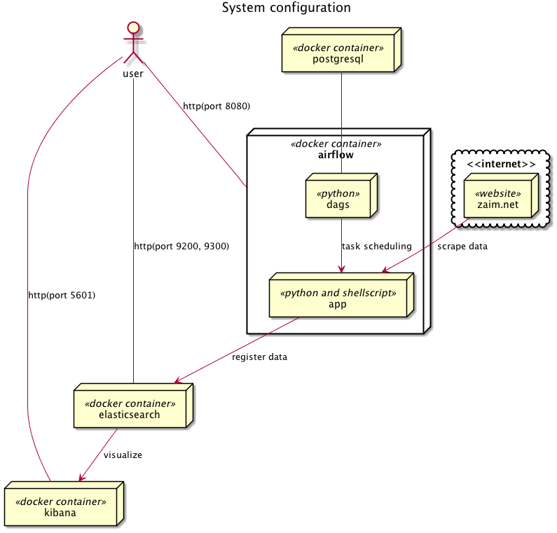

# Zaim Analysis Platform

Zaim.net の家計簿データを定期的にスクレイプしてきて、elasticsearchに突っ込んで、kibanaで描画するためのdockerプラットフォームです。



## Getting Started

自身のZaim.netのID,PASSを書き込んだconfig.ymlファイルを作り、dockerコンテナを起動。
```{bash}
$ echo "ID: your_user_id" > py_scraping/config.yml
$ echo "PASS: your_password" >> py_scraping/config.yml
$ docker-compose up -d
$ docker-compose logs
```

## License

This project is licensed under the Apache License 2.0 - see the [LICENSE](LICENSE) file for details
