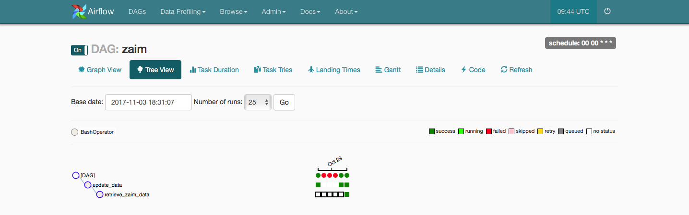
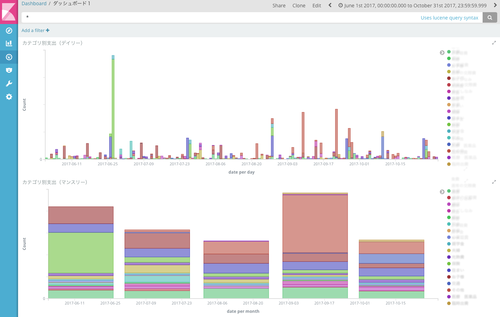

# Zaim Analysis Platform

Zaim.net の家計簿データを定期的にスクレイプしてきて、elasticsearchに突っ込んで、kibanaで描画するためのdockerプラットフォームです。


## Getting Started

自身のZaim.netのID,PASS,スクレイピングしたい家計簿データの開始日を書き込んだconfig.ymlファイルを作り、dockerコンテナを起動する。

```{bash}
$ echo 'ID: "your_user_id"' > py_scraping/app/config.yml
$ echo 'PASS: "your_password"' >> py_scraping/app/config.yml
$ echo 'START_DATE: "2016-1-1"' >> py_scraping/app/config.yml
$ docker-compose up -d
$ docker-compose logs
```

スケジュールされたジョブが上手く実行できない場合、dagのstart_dateを修正する。

```{bash}
$ date=`date +"%Y, %m, %-d, 00, 00, 00"` && sed -i '' 's/datetime.today()/datetime('$date')/g' py_scraping/dags/zaim.py
```

http://localhost:8080 でairflowにアクセス。



http://localhost:5601 でkibanaにアクセス。
zaim* の Index Pattern を作って、あとは適当にビジュアライズする。



## License

This project is licensed under the Apache License 2.0 - see the [LICENSE](LICENSE) file for details
